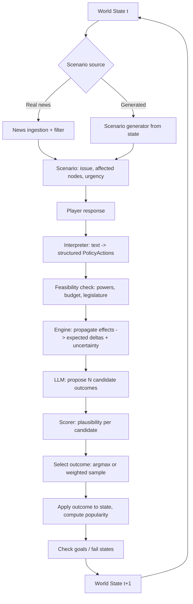

# Head of Government Simulator — Implementation Plan

> Living document. Each numbered **Project** below is a self-contained workstream that can be picked up in its own session. Update the status table, decision log and open questions as work progresses.

### How to use this plan
- This file is the **index**: vision, architecture, contracts between projects, status, decisions.
- When a project is picked up, create `plan/projects/NN-short-name.md` (e.g. `03-simulation-engine.md`) from the template in §12 and expand it there. Keep the summary in §6 short and link to the detailed file.
- A project may only depend on another through the **interfaces** listed in §6a. If a project needs to change an interface, record it in the Decision Log (§9) so other projects see it.

---

## 1. Vision

A turn-based political simulation where the player is a Prime Minister or President. Each turn:

1. A **scenario** arrives — drawn from real news (via the internet) or generated from the current world state.
2. The player **responds** (free text or chosen actions).
3. The game **forecasts** several plausible outcomes, scores them, and **selects** one.
4. The outcome **changes the world** (economy, sectors, population groups, other countries), which shifts **popularity** across groups.
5. The new world state seeds the **next scenario**. Repeat.

Goals are chosen at the start: stay popular / win re-election, or pursue a transformative goal such as a social or economic revolution.

---

## 2. Core Design Principle: "The LLM proposes, the engine disposes"

The single most important architectural decision. If the LLM owns the numbers, the world will drift, contradict itself, and become impossible to balance or test.

| Responsibility | Owner |
|---|---|
| World state (all numbers, relationships, history) | **Deterministic engine** (Python) — single source of truth |
| Effect propagation through economy/society/world | **Deterministic engine** (graph propagation, seeded randomness) |
| Popularity calculation | **Deterministic engine** |
| Turning news into a scenario | LLM, constrained to structured output |
| Turning player text into concrete policy actions | LLM, constrained to an action schema |
| Proposing candidate outcomes + narrative | LLM, conditioned on engine deltas |
| Judging outcome plausibility | Blend: engine consistency + LLM judgement + base rates |
| Flavour text, headlines, reactions | LLM |

Every LLM call returns **validated structured data** (Pydantic models). Anything that fails validation is retried or rejected — never written to state.

---

## 3. The Turn Loop



**Time step:** one turn = one month (configurable). Some effects are lagged across several turns (e.g. interest-rate changes, infrastructure spend).

---

## 4. Architecture Overview

```
hog_sim/
├── core/
│   ├── models.py          # Pydantic schemas: Country, Sector, Group, Indicator, Edge, PolicyAction, Scenario, Outcome
│   ├── state.py           # WorldState container, snapshot/diff, serialisation
│   └── config.py
├── world/
│   ├── graph.py           # NetworkX graph build + queries
│   ├── propagation.py     # shock propagation, lags, damping, noise
│   └── seed/              # seed data loaders (ONS, World Bank, OECD, polling)
├── population/
│   ├── groups.py          # demographic/interest groups and their indicator weights
│   └── popularity.py      # approval per group -> national vote intention
├── llm/
│   ├── client.py          # API wrapper, retries, caching, cost tracking
│   ├── prompts/           # versioned prompt templates
│   ├── scenario_gen.py
│   ├── interpreter.py
│   └── outcome_gen.py
├── forecasting/
│   ├── candidates.py      # candidate outcome generation orchestration
│   ├── scoring.py         # plausibility scoring + ensemble
│   └── selection.py       # argmax / temperature sampling
├── news/
│   ├── sources.py         # RSS / GDELT / search
│   ├── classify.py        # issue taxonomy mapping
│   └── filter.py          # compatibility with diverged game world
├── game/
│   ├── loop.py            # turn orchestration
│   ├── goals.py           # win/loss conditions, game modes
│   ├── institutions.py    # legislature, courts, central bank, media
│   └── persistence.py     # SQLite saves, turn history
├── ui/
│   └── cli.py             # MVP interface (Textual / Rich)
├── eval/
│   ├── backtests/         # historical episodes for calibration
│   └── replay.py
└── tests/
```

**Suggested stack:** Python 3.12, Pydantic v2, NetworkX, SQLite (via SQLModel or plain sqlite3), pandas/numpy, Rich/Textual for the CLI, an LLM API with tool-use / structured outputs, pytest. Graph DB (Neo4j) only if the in-memory graph becomes a bottleneck — unlikely at this scale.

---

## 5. Data Model (first sketch)

### Node types
| Node | Examples | Key attributes |
|---|---|---|
| `Country` | UK, US, China, EU, Russia | GDP, growth, relationship score with player, stance, stability |
| `Sector` | Energy, Finance, Manufacturing, Health, Housing, Retail, Agriculture, Tech, Public Sector | output, employment, prices, investment, sentiment |
| `Group` | Pensioners, Young renters, Public sector workers, Business owners, Rural, Low-income families, Students | population share, turnout propensity, indicator weights, party lean |
| `Institution` | Legislature, Central bank, Courts, Media, Unions, Civil service | support for government, power level, independence |
| `Indicator` | Inflation, unemployment, interest rate, deficit, debt/GDP, house prices, NHS waits, crime, energy prices, inequality (Gini), migration | value, trend, history |

### Edge types
| Edge | From → To | Meaning |
|---|---|---|
| `TRADES_WITH` | Country → Country | trade volume, dependency |
| `ALLIED_WITH` / `RIVAL_OF` | Country → Country | diplomatic weight |
| `SUPPLIES` | Sector → Sector | input–output linkage (from OECD IO tables) |
| `EMPLOYS` | Sector → Group | employment share |
| `CARES_ABOUT` | Group → Indicator | weight in approval function |
| `DRIVES` | Sector/Policy → Indicator | elasticity / coefficient |
| `INFLUENCES` | Institution → Group | e.g. media framing |

Each edge carries `weight`, `lag` (turns), and `uncertainty` (std dev used in Monte Carlo).

### PolicyAction schema (what the interpreter must output)
```python
class PolicyAction(BaseModel):
    kind: Literal["tax", "spend", "regulate", "deregulate", "diplomatic",
                  "military", "communicate", "legislate", "appoint", "do_nothing"]
    target: str                 # node id, e.g. "sector:energy", "country:china"
    magnitude: float            # normalised -1..1 or concrete units by kind
    duration_turns: int
    requires: list[str]         # e.g. ["legislature_majority"]
    rationale: str              # LLM's reading of the player's intent
```

---

## 6. Projects

Each project: **Goal · Scope · Deliverables · Key decisions · Open questions · Done when**.

### Project 0 — Foundations
- **Goal:** Repo, tooling, and the shared vocabulary everything else depends on.
- **Scope:** Project layout, dependency management (uv/poetry), lint/format, pytest, logging, config, seeded RNG.
- **Deliverables:** Empty-but-wired package; `core/models.py` with first-pass schemas; CI running tests.
- **Done when:** `pytest` passes on skeleton; a dummy `WorldState` serialises and round-trips.

### Project 1 — World Model & State
- **Goal:** Represent the world as a typed graph with a clean state container.
- **Scope:** Node/edge schemas; WorldState with snapshot + diff; NetworkX build from state; query helpers ("which groups are exposed to sector X?").
- **Deliverables:** `world/graph.py`, `core/state.py`, unit tests; a hand-built toy world (1 country, 5 sectors, 4 groups, 2 foreign countries).
- **Key decisions:** Granularity of sectors/groups for MVP; whether indicators are nodes or attributes (recommend nodes — makes `CARES_ABOUT` and `DRIVES` edges explicit and inspectable).
- **Done when:** Toy world builds, can be queried, snapshot/diff works across a manual change.

### Project 2 — Seed Data
- **Goal:** Ground the starting world in real figures.
- **Scope:** Loaders for baseline indicators and relationships.
- **Candidate sources:** ONS (UK macro, labour market), World Bank / IMF APIs (country macro), OECD input–output tables (sector linkages), UN Comtrade (trade flows), published polling crosstabs (group party lean), census (group sizes).
- **Deliverables:** `world/seed/` loaders producing a versioned `start_state_uk_YYYYMM.json`; equivalent for a US presidential start.
- **Key decisions:** Live fetch at game start vs. periodic snapshot (recommend snapshot — reproducible and offline-friendly).
- **Done when:** A realistic UK start state loads with ≥8 sectors, ≥6 groups, ≥5 countries, ≥12 indicators.

### Project 3 — Simulation Engine (Propagation)
- **Goal:** Given policy actions and external shocks, compute how the world changes.
- **Scope:**
  - Shock representation (node, delta, start turn).
  - Propagation along edges with weights, lags and damping (start linear; add saturation/thresholds later).
  - Lag queue so effects land over future turns.
  - Monte Carlo mode: run K draws using edge uncertainty → distribution of indicator deltas.
  - Feedback loops (e.g. unemployment → spending → retail output) with damping to prevent explosions.
- **Deliverables:** `world/propagation.py` returning expected deltas + percentiles.
- **Key decisions:** System-dynamics style difference equations vs. agent-based. Recommend difference equations on the graph for MVP; agent-based for foreign countries later.
- **Done when:** A tax rise on energy produces sensible signed effects on energy prices, inflation, low-income approval, with lagged tail, and results are reproducible with a fixed seed.

### Project 4 — Population & Popularity
- **Goal:** Turn indicators and events into approval by group and overall.
- **Scope:**
  - Per-group approval = baseline lean + Σ(weight × normalised indicator change) + event salience effects + media framing.
  - Memory/decay: recent events matter more; long-term trust accumulates slowly.
  - Aggregate to national approval and vote intention using population share × turnout.
  - Periodic elections with seat model (simple uniform swing for MVP).
- **Deliverables:** `population/popularity.py`; dashboard-ready per-group time series.
- **Done when:** Running the toy world for 24 turns with no actions gives stable approval; a known-unpopular action moves the expected groups in the expected direction.

### Project 5 — LLM Layer: Scenarios & Interpretation
- **Goal:** Natural-language in and out, structured data in the middle.
- **Scope:**
  - **Scenario generator:** reads compressed state summary (stressed indicators, angry groups, foreign tensions, recent history) → returns `Scenario` (title, briefing, affected nodes, urgency, suggested options, stakeholder positions).
  - **Interpreter:** player's free text → list of `PolicyAction` + clarifying question if ambiguous.
  - **Feasibility:** engine-side check against powers (PM needs Commons majority; President has executive orders but Congress controls budget), budget, and institutional resistance.
  - Prompt versioning, response caching, cost/latency logging, smaller model for classification and a stronger one for narrative.
- **Deliverables:** `llm/` modules with Pydantic-validated outputs and a test suite of fixed prompts → expected structure.
- **Done when:** 20 varied player responses map to sensible action lists; invalid outputs are caught and retried.

### Project 6 — Outcome Forecasting & Selection
- **Goal:** The heart of the game — generate plausible futures and pick one.
- **Scope:**
  1. Engine produces expected deltas + uncertainty bands for the chosen actions.
  2. LLM proposes N (e.g. 4–6) candidate outcomes conditioned on those deltas, each with narrative, discrete events (strikes, market reaction, foreign response), and claimed indicator shifts.
  3. **Scoring ensemble** per candidate:
     - *Consistency score* — distance between claimed shifts and engine distribution (likelihood under the Monte Carlo draws).
     - *LLM judge* — separate call estimating probability given context.
     - *Base-rate prior* — e.g. how often do budgets trigger market selloffs? (curated table, grows over time).
     - Weighted combination, normalised to probabilities.
  4. **Selection:** argmax ("most likely" mode) or temperature sampling ("realistic" mode).
  5. Apply: engine deltas are authoritative; LLM-proposed discrete events become new shocks.
- **Design note:** Always choosing the single most likely outcome makes the game deterministic and players can learn to "solve" it. Recommend making selection mode a difficulty setting, with sampling as default.
- **Deliverables:** `forecasting/` package; logging of all candidates and scores each turn (great for debugging and for an in-game "what nearly happened" view).
- **Done when:** Candidates are diverse, scores are calibrated enough that selected outcomes look sensible on manual review of 30 turns.

### Project 7 — News Ingestion
- **Goal:** Pull real issues into the game.
- **Scope:**
  - Sources: RSS (BBC, Guardian, Reuters, FT headlines), GDELT for event/tone data, or an LLM web-search tool.
  - Classify each story into the issue taxonomy and map to graph nodes.
  - **Divergence filter (important):** after turn 1 the game world diverges from reality. Domestic political news ("the PM announced…") will contradict game state. Treat real news primarily as **exogenous shocks** — foreign events, markets, disasters, technology, commodity prices — and adapt domestic stories rather than importing them verbatim.
  - Deduplication and freshness window.
- **Deliverables:** `news/` package producing candidate shocks/scenarios with a compatibility score.
- **Done when:** Daily fetch yields ≥5 usable scenario seeds that don't contradict a 20-turn-old game state.

### Project 8 — Game Loop, Institutions & Persistence
- **Goal:** Wire everything into a playable loop.
- **Scope:** Turn orchestration; save/load (SQLite: one row per turn with state snapshot, scenario, response, candidates, chosen outcome); institutions as constraints and actors (legislature votes, central bank reacts to inflation, media frames events, courts can block); scenario source selection (news vs generated vs scheduled events like budgets/elections).
- **Done when:** A full 12-turn game can be played, saved mid-way, resumed, and replayed deterministically from the log.

### Project 9 — Goals, Game Modes & Fail States
- **Goal:** Give the player something to aim for.
- **Modes:**
  - *Survival / Re-election:* maintain approval, win elections.
  - *Social revolution:* hit thresholds on e.g. inequality, public ownership share, welfare coverage, institutional reform — while not collapsing support.
  - *Economic revolution:* e.g. sector-mix transformation (green transition, nationalisation, radical deregulation).
  - *Custom:* player-defined indicator targets.
- **Fail states:** vote of no confidence, election loss, impeachment, sovereign debt crisis, coup/mass unrest, removal by own party.
- **Done when:** Each mode has measurable win/loss checks evaluated every turn and a final score summary.

### Project 10 — Interface
- **MVP:** Rich/Textual CLI — briefing, free-text response, outcome narrative, indicator and group approval tables, sparkline history.
- **Later:** Web UI (FastAPI backend + front end) with graph visualisation of the world, approval charts, a news ticker, and a "forecast fan" showing candidate outcomes and their probabilities.

### Project 11 — Evaluation & Calibration
- **Goal:** Make the world model behave believably — this is where forecasting experience pays off.
- **Scope:**
  - **Backtests:** encode historical episodes as scenario + action (e.g. 2022 mini-budget, 2008 bank bailouts, Brexit referendum result, 2020 lockdowns) and check direction/magnitude of engine deltas against what happened.
  - Tune edge weights against backtests (start manual; later fit).
  - Stability tests: long no-action runs shouldn't explode or flatline.
  - LLM output quality checks: diversity of candidates, consistency, rate of validation failures.
  - Calibration of outcome probabilities over many simulated turns.
  - **Known balance issue (2026-10-01):** spending on everything lifts approval from 46% to 61% by the election because the deficit barely hurts. Deficit and debt need a stronger, lagged cost (bond yields, Bank Rate, business confidence) and a backtest that catches it. Found by the "Fix scores not updating" thread; fix in review as PR #13 (deficit shocks from spend and tax, debt penalty above a 6% deficit).
- **Done when:** Agreed backtest suite passes direction checks and the engine is stable over 120 turns.

### Project 12 — Stretch Goals
- Foreign countries as LLM- or rule-driven agents with their own goals and responses.
- Cabinet ministers with competence/loyalty; leadership challenges.
- Opposition party AI and campaign phases.
- Scandals and random events table.
- Multiple starting countries / historical start dates.
- Multiplayer (players as different countries).

### Project 13 — Scenario Depth
- **Goal:** Scenarios that feel like a living political world: ongoing storylines, several issues per turn, variety, recurring characters, pledges and a political calendar.
- **Scope:** `Storyline` and in-tray (2–4 issues) in `WorldState`; anti-repetition and a 12-category issue taxonomy; a 60+ scenario offline library; fictional recurring cast with loyalty; pledges; calendar events. Builds on Project 5's generator and Project 2's bigger world.
- **Backlog:** stories SD-1 to SD-8 in [backlog/scenarios-and-responses.md](backlog/scenarios-and-responses.md).
- **Done when:** In a 30-turn Claude game, at least one storyline spans 3+ turns, no category supplies more than 25% of lead issues, and no two lead titles are near-duplicates; offline play doesn't repeat within 15 turns.

### Project 14 — Response Builder
- **Goal:** Expressive responses: pick and combine options, review and edit the interpreted actions, ask advisers for new options, and have the delivery (framing, consultation, timing) shape the outcome.
- **Scope:** numbered option picking plus free text; a confirm/edit step before resolve; `advise` command; delivery fields from the interpreter fed into Project 6 scoring; a saved policy library; new action kinds for Project 9's revolution goals.
- **Backlog:** stories RB-1 to RB-7 in [backlog/scenarios-and-responses.md](backlog/scenarios-and-responses.md).
- **Done when:** A player can build, review and commit a multi-part package in one turn; the same actions delivered differently give measurably different outcome probabilities on a fixture.

### 6a. Dependencies & Interfaces

What each project consumes and provides, so projects can be built in parallel against stubs.

| # | Project | Depends on | Provides (interface) |
|---|---|---|---|
| 0 | Foundations | — | Package layout, `core/models.py` schemas, config, seeded RNG |
| 1 | World Model & State | 0 | `WorldState`, `snapshot()`/`diff()`, graph query helpers |
| 2 | Seed Data | 1 | `load_start_state(country, date) -> WorldState` |
| 3 | Simulation Engine | 1 | `propagate(state, shocks, horizon, k_draws, seed) -> DeltaDistribution`, `simulate()`, `actions_to_shocks()`, `apply_deltas()` |
| 4 | Population & Popularity | 1, 3 | `step_approval(state, reference)`, `target_approval()`, `national_approval()`, `vote_intention()`, `run_election()` |
| 5 | LLM: Scenarios & Interpretation | 0, 1 | `summarise_state(state) -> StateSummary`, `generate_scenario(summary, client) -> GeneratedScenario`, `interpret(text, summary, client) -> Interpretation` (actions + optional clarifying question), `policy/feasibility.py: check_feasibility(actions, state, role) -> FeasibilityReport` |
| 6 | Forecasting & Selection | 3, 4, 5 | `LLMForecaster.forecast(state, scenario, actions, engine) -> [Outcome]` (ensemble: engine consistency, LLM judge, base rates), `select(candidates, mode, rng) -> index`, `game/llm_plugins.llm_plugins(client)` |
| 7 | News Ingestion | 1, 5 | `fetch_seeds(state) -> [ScenarioSeed]` with compatibility score |
| 8 | Game Loop & Persistence | 3–6 | `Game.play_turn()`, `Game.resume()`, `replay()`, `SaveStore`; plug-in protocols in `game/interfaces.py` (Project 5 needs small adapters: its `interpret` takes a `StateSummary` and returns an `Interpretation`) |
| 9 | Goals & Modes | 4, 8 | `check_goals(state, mode) -> Progress / Win / Loss` |
| 10 | Interface | 8 | CLI, later web UI |
| 11 | Evaluation & Calibration | 3, 4, 6 | Backtest suite, tuned weights |
| 13 | Scenario Depth | 2, 5, 8 | `Storyline`, `InTray` in `WorldState`; `generate_turn(summary, storylines, client) -> InTray`; offline `ScenarioLibrary` |
| 14 | Response Builder | 5, 6, 10 | `ResponsePackage` (picked options + text + delivery), confirm/edit step in `Game`, `advise(question, summary, client) -> [Option]` |

**Stub-first rule:** each project ships a trivial stub of its interface early (e.g. `propagate` returning zero deltas, `generate_scenario` returning a canned scenario) so the full loop in Project 8 runs end to end from the start and every project improves one piece of a working game.

---

## 7. MVP Definition

Smallest thing that is fun and proves the architecture:

- One country (UK, PM mode), 8 sectors, 6 groups, 4 foreign countries, ~12 indicators.
- Generated scenarios only (no internet yet).
- Free-text responses → interpreter → engine → 4 candidate outcomes → weighted selection.
- Popularity by group; survival mode with a single election at turn 24.
- CLI, SQLite saves, full turn logging.

**MVP build order:** 0 → 1 → 3 → 4 → 5 → 6 → 8 → 10 (CLI) → then 2 (real seed data), 7 (news), 9 (modes), 11 (calibration).

---

## 8. Status Tracker

| # | Project | Status | Notes |
|---|---|---|---|
| 0 | Foundations | Done | Skeleton, core schemas, CI on main |
| 1 | World Model & State | Done (PR #1) | See projects/01-world-model.md |
| 2 | Seed Data | Not started | |
| 3 | Simulation Engine | Done (PR #2) | See projects/03-simulation-engine.md |
| 4 | Population & Popularity | Done (PR #3) | See projects/04-popularity.md |
| 5 | LLM: Scenarios & Interpretation | Done (PR #5) | See projects/05-llm-layer.md |
| 6 | Outcome Forecasting & Selection | Done (PR #6) | See projects/06-forecasting.md; needs a live 30-turn review |
| 7 | News Ingestion | Not started | |
| 8 | Game Loop & Persistence | Done (PR #4) | Loop, saves, replay, CLI on stubs; see projects/08-game-loop.md |
| 9 | Goals & Modes | Not started | |
| 10 | Interface | Not started | |
| 11 | Evaluation & Calibration | Not started | |
| 12 | Stretch | Not started | |
| 13 | Scenario Depth | Backlog | Stories SD-1 to SD-8 in backlog/scenarios-and-responses.md |
| 14 | Response Builder | Backlog | Stories RB-1 to RB-7 in backlog/scenarios-and-responses.md |

---

## 9. Decision Log

| Date | Decision | Rationale |
|---|---|---|
| 2026-10-01 | Engine owns state; LLM only proposes structured data | Consistency, testability, balance |
| 2026-10-01 | NetworkX + SQLite before any graph DB | Scale is small; simpler ops |
| 2026-10-01 | Real news treated mainly as exogenous shocks | Game world diverges from reality after turn 1 |
| 2026-10-01 | Outcomes scored by ensemble: engine consistency + LLM judge + base-rate priors | Grounds the LLM's candidates in the engine's Monte Carlo distribution |
| 2026-10-01 | Argmax vs weighted sampling is a difficulty setting (sampling default) | Always picking the most likely outcome makes the game solvable |
| 2026-10-01 | Engine calibrated against historical backtests (Project 11) | Checks direction and size of effects against real episodes |
| 2026-10-01 | MVP: UK PM, generated scenarios only, free text, group popularity, one election at turn 24, CLI | Prove the core loop before seed data, news and revolution modes |
| 2026-10-01 | Start with Project 0 and Project 1 together (schemas first) | Every other project is written against these models |
| 2026-10-01 | Engine works in normalised standard steps; effects in flight live in `WorldState.pending` | Comparable edge weights; lagged effects survive across turns and saves |
| 2026-10-01 | Turns split into decide (may call LLM) and resolve (deterministic, from the log) | Exact replay without LLM calls |
| 2026-10-01 | The LLM reads a `StateSummary`, never the WorldState; feasibility is deterministic engine code | Keeps the LLM out of the numbers |
| 2026-10-01 | Startup shows the mode (offline practice or Claude with its model); `--llm` without a key exits with help (PR #7) | Ed couldn't tell whether Claude was in use |
| 2026-10-01 | Richer scenarios and responses become Projects 13 and 14; P1 order SD-3, RB-2, RB-1, SD-1, SD-2, RB-3, RB-4 | Ed's first play-through found scenarios basic and repeating and responses hard to combine |

---

## 10. Open Questions

- ~~Free text only, or free text plus suggested options each turn?~~ Both, combinable (RB-1).
- Turn length: fixed monthly, or variable (crises compress time)?
- How much should the player see of the forecast candidates — hidden, or shown as "advisor briefings" before committing?
- How to handle sensitive real-world content from news (wars, attacks) — tone, filtering, opt-outs.
- Which LLM calls justify a larger model vs. a cheaper one; target cost per turn?
- Should foreign leaders be named real people or fictionalised? (Recommend fictionalised or role-titled to avoid putting words in real people's mouths.)
- Seat model for elections: uniform swing vs. MRP-lite by group geography?

---

## 11. Risks

| Risk | Mitigation |
|---|---|
| LLM outputs drift or contradict state | Strict schemas, engine as source of truth, state summary in every prompt |
| Runaway feedback loops | Damping, caps, stability tests |
| Dominant strategies (e.g. spend on everything, see Project 11) | Real costs for deficits, backtests against unpopular-but-necessary episodes |
| Game becomes solvable/deterministic | Sampling selection mode, hidden variables, random events |
| Cost/latency per turn too high | Caching, smaller models for classification, batch candidate generation in one call |
| News incompatible with game world | Divergence filter; adapt rather than import |
| Opaque outcomes frustrate players | Show causal chain ("energy tax → prices +3% → low-income approval −4") |

---

## 12. Sub-project Template

Copy into `plan/projects/NN-short-name.md` when starting a project.

```markdown
# Project NN — Name

**Status:** Not started | In progress | Done
**Depends on:** …   **Provides:** … (must match §6a in the main plan)

## Goal
## Scope (in / out)
## Design
## Interface (signatures + schemas)
## Tasks
- [ ] …
## Tests / Done when
## Decisions
## Open questions
```

